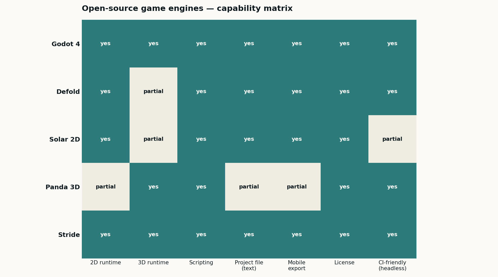

<div align="center">

# Game Development Portfolio

**by Katherine Feemster**

### Senior Game Development Specialist · Cross-Engine Pipelines · Godot · Defold · Panda 3D · Stride

[🌐 **Live portfolio site**](https://katherinejenniferhsfeemster.github.io/game-development-portfolio/) · [GitHub repo](https://github.com/katherinejenniferhsfeemster/game-development-portfolio)

      

*Five FOSS engines, one Python pipeline. Every sprite, scene and voxel is deterministic and diff-able in git — AI-dataset friendly game-dev at scale.*

</div>

---

## Contents

- [Highlighted projects](#highlighted-projects)
- [Reproducibility](#reproducibility)
- [Tech stack](#tech-stack)
- [Editorial style](#editorial-style)
- [Repo layout](#repo-layout)
- [About the author](#about-the-author)
- [Contact](#contact)

---

## Hero



---

## Highlighted projects

| Project | Stack | What it proves |
| :-- | :-- | :-- |
| **[Godot 4 procedural pipeline](projects/godot-procedural-pipeline/)** | Godot 4 · GDScript | `project.godot` + `.tscn` + GDScript voxel builder + headless glTF exporter. |
| **[Defold atlas + behaviour capture](projects/defold-atlas-pipeline/)** | Defold · Lua | `game.project` + `.collection` + `.atlas` + Lua behaviour capture → CSV. |
| **[Solar 2D scene generator](projects/solar2d-scene-generator/)** | Solar 2D · Lua | `main.lua` + `config.lua` + `build.settings` + deterministic particle system. |
| **[Panda 3D scene + headless capture](projects/panda3d-scene-bundler/)** | Panda 3D · Python | `scene.egg` voxel graph + offscreen framebuffer capture for CV datasets. |
| **[Stride (Xenko) .NET pipeline](projects/stride-xenko-pipeline/)** | Stride 4.2 · C# | `.sln` + `.csproj` + `.sdpkg` + YAML `.sdscene` + C# DataCaptureComponent. |

---

## Reproducibility

```bash
pip install numpy pillow matplotlib pyyaml
python3 scripts/python/run_all.py
```

Six stages write all five engine projects plus the posters. The engines themselves are only needed to *run* the generated projects, not to regenerate them.

---

## Tech stack

- **Godot 4** — GDScript, scene / resource format, `DirAccess` asset loaders, headless `--export-debug`, glTF export.
- **Defold** — Lua scripts, `.collection` scene graph, atlas packing, behaviour capture → CSV.
- **Solar 2D** — Lua, `build.settings` for iOS / Android, deterministic particle systems.
- **Panda 3D** — Python, `scene.egg` authoring, offscreen framebuffer capture for CV datasets.
- **Stride (Xenko)** — C# + YAML `.sdscene`, `.sln` / `.csproj` / `.sdpkg`, DataCaptureComponent pattern for ML.

---

## Editorial style

- **Palette** — teal `#2E7A7B` + amber `#D9A441` on ink `#0F1A1F` / paper `#FBFAF7`.
- **Type** — Inter (UI) + JetBrains Mono (code, netlists, timecode).
- **Determinism** — every generator is seeded; PNG, CSV and project-file bytes are stable across CI runs.
- **Licensing** — every tool in the pipeline is FOSS. No commercial SDK in the dependency tree.

---

## Repo layout

```
game-development-portfolio/
├── projects/                    # case-study READMEs (one per engine)
├── scripts/python/              # 6 generators + art helpers — the source of truth
├── scripts/projects/            # generated Godot / Defold / Solar 2D / Panda 3D / Stride
├── assets/renders/              # five posters
├── docs/                        # GitHub Pages site
└── .github/workflows/           # CI re-runs the whole pipeline on push
```

---

## About the author

Senior game-development specialist shipping cross-engine game and interactive assets — most recently focused on data-generation pipelines for AI research programs. Engine selection, asset pipelines, CI automation and headless capture tooling under one roof.

Open to remote and contract engagements. This repository is the living portfolio companion to my CV.

---

## Contact

**Katherine Feemster**

- GitHub — [@katherinejenniferhsfeemster](https://github.com/katherinejenniferhsfeemster)
- Live site — [katherinejenniferhsfeemster.github.io/game-development-portfolio](https://katherinejenniferhsfeemster.github.io/game-development-portfolio/)
- Location — open to remote / contract

---

<div align="center">
<sub>Built diff-first, editor-second. Every figure on this page is produced by code in this repo.</sub>
</div>
